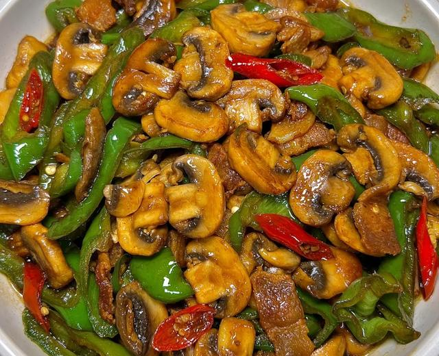

# 口蘑炒肉

来源：[下厨房](https://www.xiachufang.com/recipe/107276734/)（原名：口蘑炒肉，下饭超无敌）
标签：荤菜、快手
用时：15分钟

家常下饭菜，口蘑炒肉，超级下饭

## 成品图

## 材料

- 白蘑菇 适量个
- 猪肉 适量克
- 青椒、红椒 适量个
- 盐、生抽等

## 做法

1. 猪肉洗净切片，白蘑菇洗净后切片、青红椒洗净后切段
2. 起锅烧油，油热时候下入猪肉，煸炒一下出香味，然后倒入青椒、红椒继续煸炒
3. 放入适量生抽进行翻炒，放入适量的水，随后放入白蘑菇，继续翻炒
4. 放入白糖、盐、胡椒粉等调料，翻炒片刻就能出锅啦
