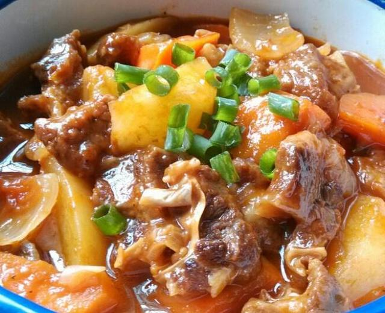

# 土豆炖牛肉

来源：[下厨房](https://www.xiachufang.com/recipe/100285641/)
标签：荤菜
用时：1.5小时

土豆炖牛肉起源于匈牙利的一道名为“古拉希”的传统名菜，后传入苏联。这道菜由于被赫鲁小夫与xx主义联系到一起，所以土豆炖牛肉便成了xx主义好日子的代名词，暨土豆炖牛肉就是xx主义。看来我们已经提前进入xx主义社会。嘿嘿……

## 成品图

## 材料

- 牛肉（牛腩） 1000g
- 土豆 2个
- 洋葱 2个
- 西红柿 4个
- 胡萝卜 1个
- 葱姜 适量
- 老抽，料酒 各1大勺
- 醋，糖 1小勺
- 番茄沙司，黑胡椒 适量
- 油 盐

## 做法

1. 牛肉切块冷水下锅焯2分钟，全程用温水清洗干净。
2. 配料洗净切块，（土豆块泡清水里）待用。
3. 锅放油烧热，先下牛肉煸炒一下，烹人老抽，料酒和一小勺白醋，
4. 接着下洋葱西红柿，撒一勺白糖继续翻炒，
5. 挤人番茄沙司（多挤一些），再磨一些胡椒粒炒匀。
6. 放葱姜，倒入足够的热水，中大火烧20分钟改小火炖1小时左右。
7. 出锅前放土豆胡萝卜块加盐烧熟。
8. 等到肉烂，汤汁粘稠就可以调味出锅了。
9. 营养丰富，颜色诱人，很下饭的一道菜。

## 小贴士

牛肉要选牛腩肋条这一部分，肥瘦相间吃起来很嫩不柴。焯水之后要用温水清洗，如果用冷水一激牛肉就不容易炖烂了。
