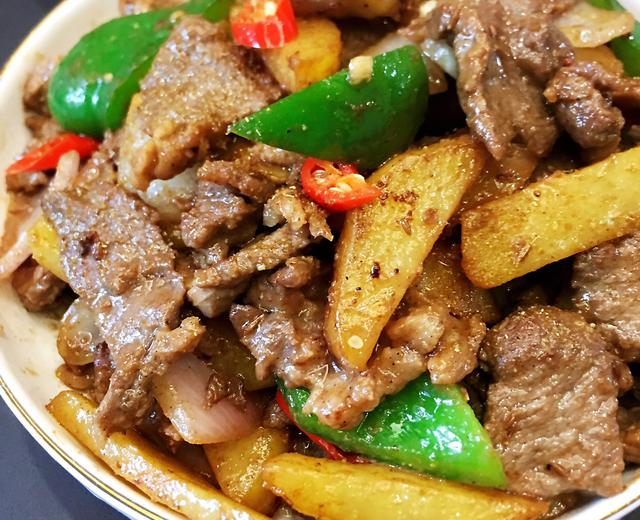

# 孜然土豆炒牛肉

来源：[下厨房](https://www.xiachufang.com/recipe/106016090/)
标签：荤菜
用时：40分钟

很下饭的一道菜💕😄，儿子说谁吃了都会爱上它😂😂😂。

## 成品图

## 材料

- 牛肉 500克
- 孜然 1勺
- 洋葱 半个
- 油 适量
- 孜然粉 少许
- 葱姜水 少许
- 盐 1勺半
- 生抽酱油 适量
- 土豆 1个
- 青红椒 各1个
- 黑胡椒粉 少许
- 糖 少许
- 地瓜粉或玉米淀粉 少许

## 做法

1. 牛肉洗净切片，加入少许葱姜水（用姜丝跟葱段加少许水用力抓挤的汁水）抓匀至汁水完全被牛肉吸收，加入盐、鸡精、黑胡椒粉、生抽，调味抓匀腌制片刻。这里的用量我只能写大约，无法精准到几克，可根据自家肉的量自行增减。
2. 在抓匀后的肉片上倒入约1汤匙的食用油再次拌匀，这就是让牛肉炒起来不老的妙招之一。用油封住牛肉的水份，炒起来就不柴了，将牛肉抓匀加入少许的地瓜粉糊，不要多，薄薄的一层就好，抓匀后放一旁备用。
3. 把所需的菜洗净，土豆切粗条状，水烧开后放点盐，放入土豆条煮熟。 有厨友问直接炸了就行，干嘛还要煮一下，多此一举。其实我的薯条切得厚又粗，个人觉得煮一下，炸的时候更容易熟透。你若觉得麻烦可省略这一步，但在炸时用小火才能炸熟。或者把薯条切小条点，别像我那样粗。
4. 土豆条煮熟后用油炸至金黄色捞出备用。
5. 锅里留适量的底油，油要比炒菜的油多些，放入牛肉大火快炒至变色盛起备用，这样炒牛肉片不容易生水。牛肉可分2次下锅炒，少量炒熟得快，不易老。若一大堆肉倒入一锅炒的话，摊不开，就容易炒把肉炒老了。
6. 牛肉盛出后留底油，放入切好的洋葱和青红椒，倒入适量的蚝油、盐和少许糖翻炒片刻。
7. 把牛肉和炸好的土豆条放入锅中，加适量的孜然粉和孜然拌匀，试试咸淡，不够味再添加调味后即可盛出。
8. 诱人的孜然土豆炒牛肉好了。超下饭，味道像烧烤牛肉，也是很适合当下酒菜哦。

## 小贴士

牛肉在腌制时已加调味，所以在炒青红椒时先放蚝油和少许糖调味菜才不会没味道。
不喜欢牛肉可以换成猪肉或者羊肉。
