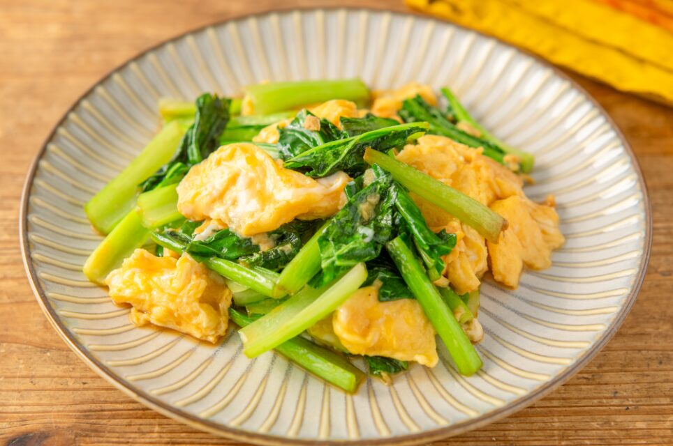

# 小松菜炒蛋（麻油香）

来源：[gomaabura.jp](https://www.gomaabura.jp/recipe/detail/12085)（日文原名：小松菜と卵の香りごま油炒め）

用「压榨纯麻油」提香的家常快手炒菜，鸡蛋先炒半熟盛出，小松菜炒香后再回锅拌合。约10分钟完成，2人份。

## 成品图

## 材料（2人份）

- 小松菜 半把
- 鸡蛋 2个
- 盐 少许
- 黑胡椒 少许
- 压榨纯麻油 1大勺（分两次用）
- 鸡汤粉 1/3小勺
- 酱油 1/2小勺

## 做法

1. 小松菜洗净沥干，切成4~5厘米长段。鸡蛋打入碗中，加盐和黑胡椒打散。
2. 平底锅中放入一半麻油（1/2大勺），中火加热，倒入蛋液炒至半熟后盛出备用。
3. 锅中放入剩下的麻油（1/2大勺），放入小松菜翻炒，加鸡汤粉和酱油炒匀。
4. 把鸡蛋倒回锅中，和小松菜轻轻拌合均匀，装盘。

## 参考数据

- 每份约141kcal，含盐量约0.9g
- 烹饪时间约10分钟
