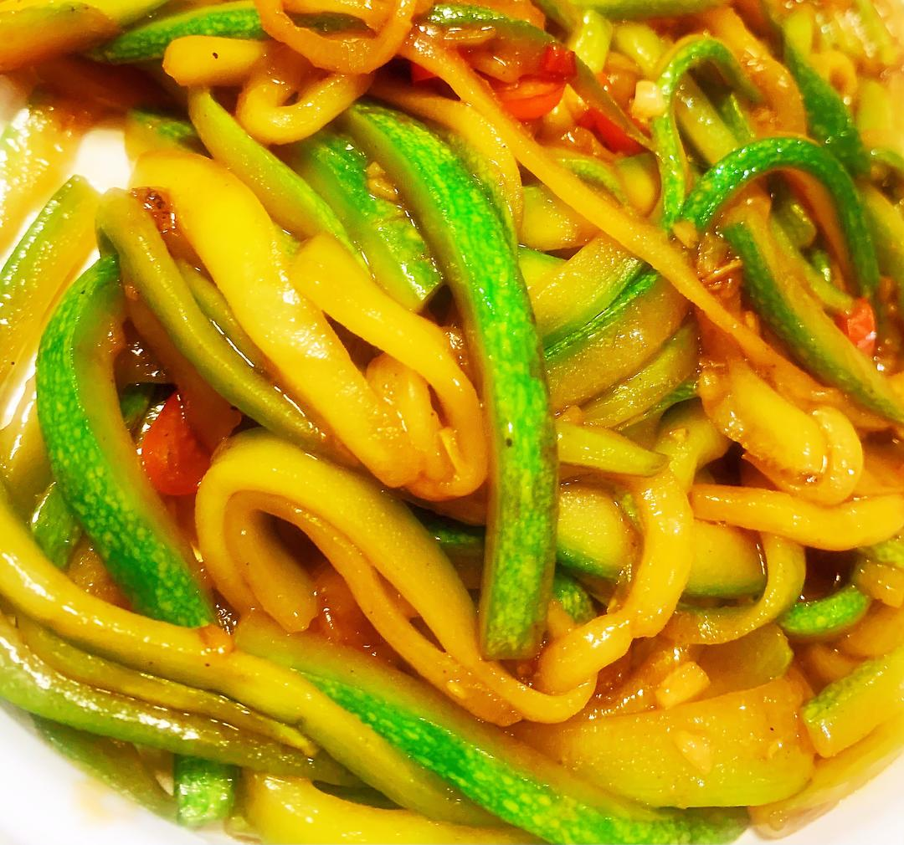

# 小炒西葫芦

来源：[下厨房](https://www.xiachufang.com/recipe/106163145/)
标签：素菜、快手
用时：15分钟

不一样的做法，不一样的口感。 菜谱调料请酌情添加，按你自己喜好咸淡就行，不用死搬硬套，多少西葫芦量配多少调料，可别一丢丢西葫芦也按我的料汁，这个菜谱做出来主要就是爽脆，炒制时间不宜太久（入锅到出锅二十秒左右就行）， 麻烦小主们看清楚菜谱，爱你们哟。❤️

## 成品图

## 材料

- 西葫芦 1个就选大的（2个就选小一点的）
- 生抽 0.5 勺
- 盐 适量（腌制用）
- 小米椒 1个
- 蒜 2瓣
- 白糖 0.5勺
- 番茄酱 0.5勺
- 香醋 几滴
- 香油 几滴

## 做法

1. 西葫芦切开去瓤
2. 切成长条
3. 取适量的盐，捏几下，让水分充分出来，别腌制太久，久了容易咸，看见出水变软就挤干。
4. 挤干盐水
5. 清水洗净！再挤干，这样吃起来更爽脆。
6. 调料汁：1勺生抽、蚝油0.5勺，糖0.5勺鸡粉0.5勺，蕃茄酱0.5勺、记着啊千万不要放盐了。（调料按照自己平时吃菜口味酌情添加，因为西葫芦也有大有小，不能定死多少调料）（个人喝汤小勺）
7. 蒜切末、小米椒切圈
8. 起锅烧油爆香料头
9. 下西葫芦丝快速翻炒
10. 倒入提前准备好的料汁
11. 翻炒后加入几滴醋，增香
12. 少许香油
13. 出锅
14. 这盘是清炒的，一样很脆，前面步骤一样，就是不调料汁了，要放：油（少）、盐（少）、糖（可不放）、鸡精，这个更家常一点，也适合减肥的小姐姐们。

## 小贴士

西葫芦入锅开始计时，炒个十几二十秒断个生就可以出锅了，时间长了就不好吃了，这样出来很脆。
