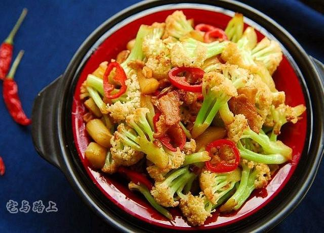

# 干煸菜花（五花肉版）

来源：[下厨房](https://www.xiachufang.com/recipe/267390/)（原名：干煸菜花）
标签：荤菜、快手
用时：20分钟

湘菜馆的干煸菜花焦香爽脆，是超人气的下饭菜，当然，来扎啤酒就更给力了。自己在家炒菜花操作不当很容易变成焖菜花，口感软烂，注意以下几点就能炒出焦香爽脆又入味的餐馆味道。 第一，最好用松花菜，松花菜又称散花菜、青梗松花菜、有机花菜、白面散花菜、有机菜花。具体样子步骤图里有。实在没有就普通菜花吧。 第二，铁锅和干锅菜花最搭配，最好用厚底铁锅，能爆炒保温性能又好。 第三，先用五花肉煸炒出油更能带出菜花的香味，肉越肥越好，不喜欢可以不吃，但配菜味道特别棒。 第四，菜花一定要沥干水分。 第五，一定要大火爆炒，略带焦色香味更浓。 第六，加一勺酱油是点晴之笔。 第七，盐一定要出锅前再放，不需多，快速炒匀后分布在菜花的表面，入口咸香更有滋味。 松花菜不用焯水，如果用普通菜花，焯水时间要短，及时过凉再充分沥干，否则真就是五花肉焖菜花了。

## 成品图

## 材料

- 松花菜 半只
- 五花肉 50克
- 生姜 5克
- 大蒜 三瓣
- 辣椒 2个
- 盐 2克
- 酱油 15克

## 做法

1. 菜花冲洗干净后用小刀沿着柄削成小朵，用淡盐水浸泡10分钟，充分沥干水分。
2. 五花肉入锅小火慢慢煸炒出油，如果肉不够肥，锅中可以先放少许油再煸，出油后加生姜炒出香味。
3. 开大火，油热的时候倒入菜花，铺匀略煎30秒再翻炒几下。
4. 盖上锅盖，调中火焗30秒。
5. 这时候可以看到菜花头有点焦色了。
6. 加入辣椒和大蒜碎翻炒几下。这个是之前的老锅，现在已经淘汰了。
7. 炒匀后加入一勺生抽，翻炒均匀。
8. 起锅前加入一勺盐炒匀即可。
9. 焦香爽脆，超级下饭。
