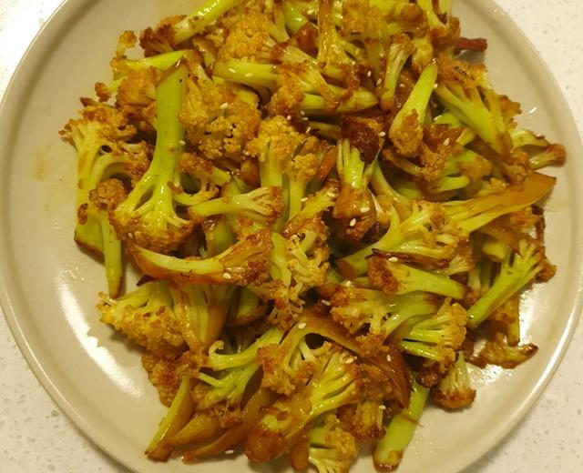

# 干煸菜花（快手版）

来源：[下厨房](https://www.xiachufang.com/recipe/104268287/)（原名：干煸菜花（五花肉））
标签：荤菜、快手
用时：15分钟

## 成品图

## 材料

- 花菜 1个
- 肥肉 30g
- 干辣椒花椒 适量
- 生抽 2勺
- 蚝油 1勺
- 鸡精 1勺
- 白糖 1勺
- 葱蒜 适量

## 做法

1. 菜花洗净，拆成大小均匀的小块。个人喜欢用剪子，方便。
2. 必须沥干水分，不要炒的时候出汤。
3. 下肥肉小火煸出油。
4. 小火先爆香花椒干辣椒，再放入葱蒜。
5. 加入菜花，大火炒制微焦，发黄。
6. 加生抽2勺、蚝油1勺、白糖1勺、鸡精1勺调味。
7. 倒入锅内，大火收干汁。
8. 出锅前加入一些芝麻，点一点香油。

## 小贴士

1.肥肉不喜欢吃可以换植物油，或者肥肉少，加一些植物园也行，不怕油多。
2.干辣椒喜欢吃辣可以多放。
3怕淡，出锅前可以加盐。
