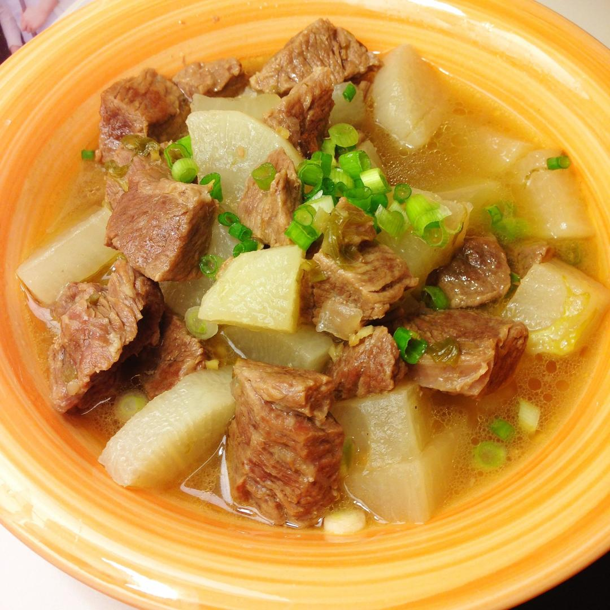

# 牛肉炖萝卜

来源：[下厨房](https://www.xiachufang.com/recipe/1071233/)
标签：荤菜、汤
用时：1小时

很适合冷冷的冬天 暖暖的 很满足。牛肉和白萝卜真是绝配 也太好吃了吧。调味料千万不要加很多 不然就会盖住牛肉和萝卜原本的味道了。 这道菜温暖了想家的心。

## 成品图

## 材料

- 牛肉
- 胡椒粉
- 白萝卜
- 葱
- 姜
- 大料
- 盐
- 生抽
- 料酒
- 糖

## 做法

1. 葱和姜都切成 葱末 姜末 和 葱段 姜片 两部分。把牛肉切成小块 冷水入锅 煮出血水。盛出牛肉 用温水冲净表面附着的血水。
2. 另起煮锅 倒入油 爆香葱姜末。倒入牛肉 翻炒。
3. 加入适量料酒和生抽 少量糖 继续翻炒。
4. 添入热水 没过牛肉。（可以多加些水 确保之后不会再添水影响味道。）放入大料 葱段 姜片 适量胡椒粉。大火煮开后转小火煮炖30分钟左右。
5. 加入白萝卜继续煮炖。炖的时间可以自己掌握 期间根据汤的口味加入适量的盐。等到白萝卜透明 牛肉的香味也溢出啦 就可以出锅享受美味了。

## 小贴士

1. 千万不要加太多的生抽 不仅汤的颜色会深 而且会盖住食物本身的味道。咸淡可以通过加盐调节。 
2. 煮炖的时间越久牛肉越烂越好吃哦。 
3. 出锅后可以撒些葱末 又美观又好吃。
