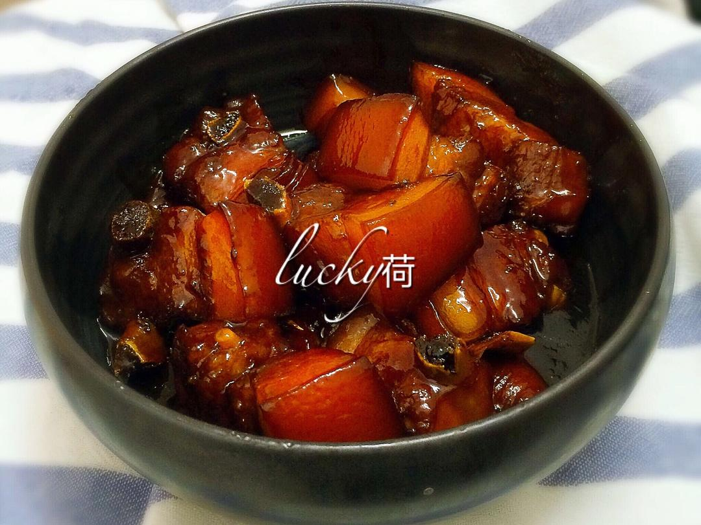

# 红烧肉

来源：[下厨房](https://www.xiachufang.com/recipe/101714088/)
标签：荤菜
用时：1小时

上海本帮风味的红烧肉，不用红曲粉、不用炒糖色，靠老抽、生抽、黄冰糖、黄酒就能烧出浓油赤酱、肥而不腻的一锅。

## 成品图

## 材料

- 猪肉（三精三肥的五花肉，最好带皮） 适量
- 生抽 适量
- 老抽 适量
- 黄（老）冰糖 一小把
- 黄酒（料酒） 适量
- 小香葱段、姜片 若干

## 做法

1. 五花肉切块洗净，放入锅中焯水。
2. 焯好水的五花肉洗净沥干水分备用。
3. 准备好小香葱段、黄冰糖、姜片。
4. 锅里放少许油烧热，放入小香葱段、姜片爆香。
5. 倒入五花肉煸炒至有肉香味飘出。
6. 依次放入黄酒（料酒）、生抽、老抽、黄冰糖调味（上海本帮口味偏甜，不喜甜可以减糖）。
7. 加入没过肉块的温水，大火煮开。
8. 转小火焖煮慢炖45分钟左右，其间翻炒几次。
9. 45分钟后开大火收汁，汤汁收浓稠大概需要10-15分钟。
10. 出锅装盘，浓油赤酱的红烧肉就做好了。

## 小贴士

1. 建议用带皮五花肉。
2. 不需要炒糖色。
3. 一定要焯水。
4. 老抽是提色的，不喜欢颜色太深可少放。
5. 生抽是提味的，注意咸淡用量。
6. 一定要放黄冰糖，做出来的肉色发亮有光泽。
7. 焖煮时要小火慢炖，收汁时当心粘底。
8. 这个方法同样可用于红烧大排骨、小排骨、猪爪。
9. 也可以放鸡蛋、鸭蛋、笋干、豆腐皮千张或马桥豆干一起烧。
10. 收汁的关键：煮的时候要一次加够没过肉块的温水，小火慢炖到肉酥烂再开大火收干，才会有漂亮的自来芡；水太少、蒸发太快，肉没炖烂水就干了，容易出现"一碗油"而不是自来芡的情况。
