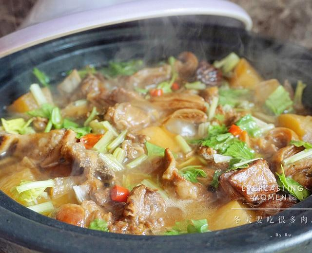

# 羊肉炖白萝卜

来源：[下厨房](https://www.xiachufang.com/recipe/102864824/)
标签：荤菜、汤
用时：1.5小时

冬天暖胃的炖羊肉，用高压锅隔水蒸过再和白萝卜一起炖，成品软烂入味又不柴。

## 成品图

## 材料

- 羊肉 1500克
- 白萝卜 1根
- 大葱 1段
- 大蒜白 1段
- 洋葱 小半个
- 小米椒 适量
- 八角 2个
- 桂皮 1小块
- 花椒 10粒
- 香叶 2片
- 生姜 1块
- 白芷 2片
- 草果 1个
- 冰糖 1块
- 啤酒 1罐
- 盐 适量
- 生抽 2汤勺
- 白胡椒粉 1小勺
- 小芹菜 几根

## 做法

1. 羊肉洗净，冷水下锅，水开后煮5-6分钟捞出洗净备用（可买带一点脂肪覆盖的部位，熟后肥而不腻）。
2. 煮羊肉的同时准备好八角、桂皮、花椒、香叶、生姜、白芷、草果等香料，葱蒜切好备用。
3. 沥干的羊肉直接下干净的锅（不放油）炒，把水分炒掉后，挑出没有脂肪的部分。
4. 剩下带脂肪的继续翻炒出油脂后盛出——去掉一些油脂，炒出的羊油炖出来更香。
5. 锅里加一些油，把步骤2准备好的香料和葱蒜爆香，放入羊肉翻炒一会儿。
6. 倒入半罐啤酒，盖锅盖焖1分钟左右，加白胡椒粉和生抽炒匀，装入大碗。
7. 隔水放入高压锅蒸（下面垫个三脚架）：电压力锅牛羊肉程序25分钟，普通高压锅上汽后转中小火15分钟。蒸好后可以分一半留着改天做红烧羊肉，另一半连汤汁用来炖萝卜。
8. 白萝卜去皮切块，洋葱、大蒜白、小米椒切好。
9. 锅里放油，爆香洋葱、蒜白、小米椒，放入白萝卜翻炒几下。
10. 放入蒸好的羊肉连汤汁一起倒入，翻炒均匀后倒入另外半罐啤酒，盖锅盖焖1分钟。
11. 加开水没过食材，烧开后盖锅盖小火焖，焖至萝卜快酥烂时放盐调味，再焖一会儿。
12. 萝卜焖烂后撒上切好的小芹菜即可。汤汁多的话也可以直接倒入火锅锅中边煮边吃。

## 小贴士

调料可以根据自己的口味调整。没有高压锅的话直接放锅里炖也可以，只是用高压锅隔水蒸过再炖，成品更软烂入味、不容易柴，也比直接炖省时间。
