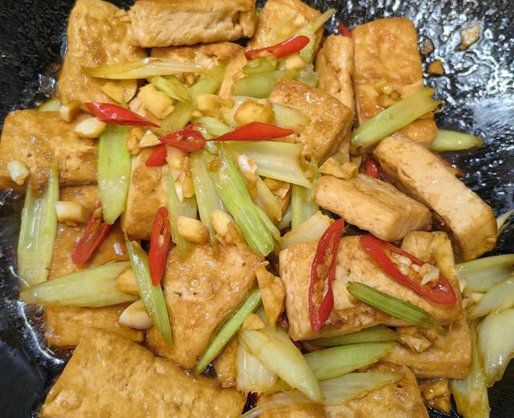

# 芹菜家常豆腐

来源：[下厨房](https://www.xiachufang.com/recipe/107192879/)（原名：好吃好做又下饭的芹菜家常豆腐）
标签：素菜、快手
用时：20分钟

楼下超市卖的老豆腐，豆腐味儿浓，跟小时候石磨磨出来的豆腐味道一样。我们一家人都喜欢吃，经常买回来换着方法做。

## 成品图

## 材料

- 老豆腐 一块（400克左右）
- 芹菜 一棵
- 蒜 5瓣
- 小米椒 适量
- 食盐 适量
- 生抽 适量
- 蚝油 适量

## 做法

1. 准备好材料，把老豆腐冲洗一下晾干表面的水。
2. 把芹菜洗干净，切好备用。 大蒜和小米椒都切碎。 用生抽、盐、蚝油加水调小半碗料汁，生抽和蚝油都有盐，加少许食盐即可。
3. 锅烧热倒适量的油，油烧热后，把切成块的豆腐放入锅里，小火煎。
4. 把豆腐煎得两面金黄。
5. 煎好的豆腐先放在盘子里。
6. 先把切好的大蒜和小米椒放入锅里，小火炒香。 再放入芹菜翻炒。
7. 倒入煎好的豆腐，把调好的料汁淋在豆腐上。
8. 翻炒几下，小火焖2分钟收汁。
9. 装盘，豆腐裹着汁液，有蒜香、咸香和小米椒的鲜香，好下饭。
