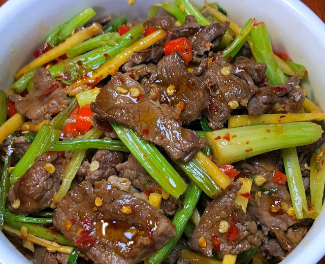

# 芹菜炒牛肉

来源：[下厨房](https://www.xiachufang.com/recipe/107017526/)（原名：下饭神器又来了，试试这道芹菜炒牛肉！！）
标签：荤菜、快手
用时：15分钟

今天分享一道芹菜炒牛肉，依旧是快手菜，真的又香又好吃😋牛肉嫩滑

## 成品图

## 材料

- 牛肉 500克
- 芹菜 100克

## 做法

1. 牛肉逆纹理切好，加蚝油、胡椒粉、少许蛋清和淀粉（薄薄一层即可）抓拌均匀，最后加少许花生油再次抓拌封油（锁住水分），腌制半小时。
2. 芹菜、小米辣、蒜切好备用。
3. 热锅热油，牛肉下锅快速滑散，炒至八九分熟盛出（时间越短牛肉越嫩）。
4. 锅留底油，倒入蒜末和小米辣爆香，接着倒入芹菜和牛肉，加盐、鸡精、辣椒面、一勺生抽调味，大火快炒7、8下即可出锅。
