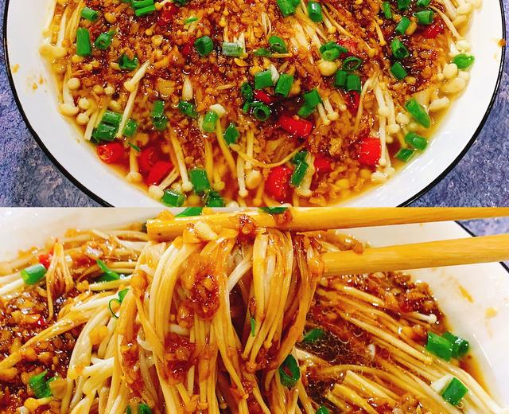

# 蒜蓉金针菇

来源：[下厨房](https://www.xiachufang.com/recipe/105909485/)（原名：超级下饭的蒜蓉金针菇！好吃到爆）
标签：素菜、快手
用时：20分钟

👉蒜香浓郁，比肉还好吃，而且超下饭～蒜蓉金针菇！清爽不油腻，做法简单，十分钟就能做好！每次做这道菜，我儿子都可以吃两碗米饭🍚

## 成品图

## 材料

- 金针菇 1捆
- 蒜 5瓣
- 生抽 2勺
- 蚝油 1勺
- 糖 半勺
- 盐 2克
- 小米辣 2个
- 葱 1根
- 蒸鱼鼓油 1勺

## 做法

1. 金针菇洗干净去根，掰小朵摆盘子里
2. 小米辣切圈。葱切花
3. 蒜打成蒜蓉
4. 起锅热油爆香蒜末和辣椒
5. 加入一小勺盐
6. 半勺白糖
7. 两勺生抽
8. 一勺蚝油
9. 翻炒均匀
10. 浇在金针菇上
11. 大火蒸8分钟
12. 出锅后淋上一勺蒸鱼鼓油，撒上葱花即可
13. 好吃又美味！
