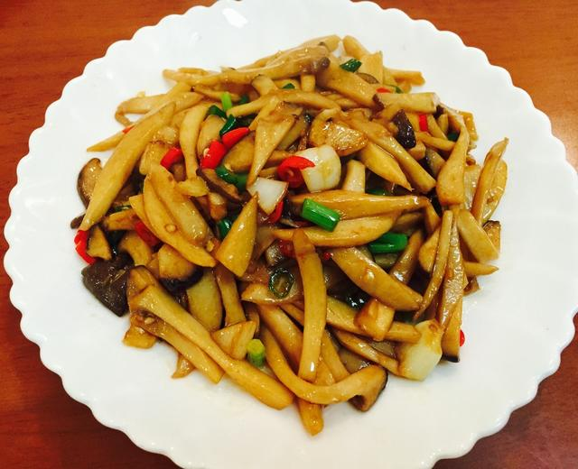

# 蚝油杏鲍菇

来源：[下厨房](https://www.xiachufang.com/recipe/101891872/)
标签：素菜、快手
用时：15分钟

## 成品图

## 材料

- 杏鲍菇 300克
- 蚝油 1勺半左右
- 姜蒜 适量
- 青红小米椒 各两个
- 生抽 1小勺
- 小香葱 2根

## 做法

1. 切好食材，杏鲍菇切成丝。
2. 姜蒜在油锅里爆香，倒入杏鲍菇翻炒至杏鲍菇稍软。
3. 加入1勺多点，约1勺半左右的蚝油，翻炒均匀。
4. 加入一点点生抽翻炒均匀
5. 加入小米椒翻炒
6. 最后出锅前撒上小香葱装盘。

## 小贴士

蚝油本身比较咸，所以不用再放盐了。
不吃辣的亲可以不放辣椒或者加一点彩椒配色。
