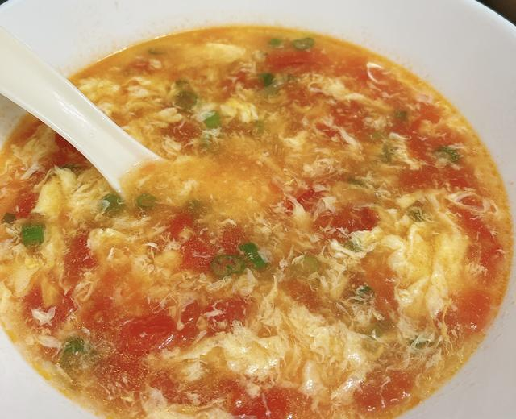

# 西红柿鸡蛋汤

来源：[下厨房](https://www.xiachufang.com/recipe/106087260/)（原名：【跟我做不会错】简单又好喝的西红柿鸡蛋汤，家常又营养哦）
标签：汤、快手
用时：15分钟

看了小高姐怀念小时候家里的味道做了番茄蛋汤的视频，我也尝试了一下，但总觉得和我小时候喝到的差点儿味道。今天改良了一下，简直就是小时候的味道，并且更加营养！细碎的西红柿，绵密的蛋花飘在上面，闪着油光，配上翠绿的葱花点缀，完美！ 爱喝汤的朋友们快和我学起来吧，新人友好快手番茄蛋汤，你值得拥有！

## 成品图

## 材料

- 西红柿 2个
- 鸡蛋 2个
- 香油 2勺
- 生抽 2勺
- 小葱 2根
- 淀粉 1勺
- 盐 1勺

## 做法

1. 番茄切成小丁儿，鸡蛋打散，葱切成葱花儿，备用。
2. 锅内油热后加入葱花炝锅儿。
3. 下入西红柿丁儿翻炒。这步是让蛋花汤更有营养，因为西红柿中的茄红素是脂溶性的，西红柿过一遍油能够让营养物质更好的释放出来。
4. 抄到西红柿软烂出汤。
5. 加入开水。我放了1000ml的开水，做了好大一锅汤。淀粉加水搅拌均匀，在汤中加入水淀粉，可以让汤变稠。
6. 开锅后，保持大火，在锅中冒泡泡的位置下入鸡蛋液，并且搅拌，蛋花一下子就出来啦！
7. 看，细密绵稠的鸡蛋花。
8. 关火后加入葱花，依据个人口味，加入生抽2勺，香油2勺，盐1勺，调味儿
9. 营养又美味的家常西红柿蛋花汤就做好啦！
10. 西红柿软烂，蛋花细碎，散发着葱香味儿和香油味儿。喝一口汤，浓浓的西红柿味儿中夹着咸香，简直完美！

## 小贴士

1.西红柿中的茄红素是脂溶性的，所以用到西红柿的菜最好过油，更好吸收营养。
2.番茄蛋汤的蛋花十分重要，锅开后一定要把蛋液洒在水开冒泡泡的地方并且搅拌，让蛋液彻底散开。
3.葱花儿可以换成香菜。
