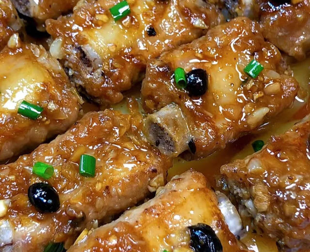

# 豆豉蒸排骨

来源：[下厨房](https://www.xiachufang.com/recipe/106804588/)（原名：豆豉蒸排骨，这个味太绝了！！）
标签：荤菜
用时：1小时

今天做这个广式蒸排骨，这个味太绝了！获得全家一致好评，营养还是蒸的好～

## 成品图

## 材料

- 排骨 500克
- 豆豉 半勺
- 土豆 1个
- 蒜瓣 适量

## 做法

1. 剁好的排骨加1勺面粉和清水反复抓洗2分钟，洗出血水和杂质，再用清水多清洗几遍，这样蒸出来的排骨才不会有腥味。
2. 碗中放2勺蒜末、小半勺豆豉，浇上热油激发香味，加2勺生抽、1勺蚝油、少许盐和白糖调味。
3. 搅拌均匀后倒入排骨中，再放1勺生粉抓拌均匀，腌制30分钟左右。
4. 盘底铺上土豆片，排骨摆在上面。
5. 水开上锅蒸25分钟即可，成品又嫩又滑。
