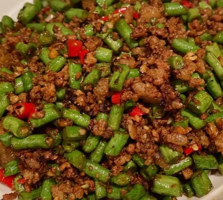

# 豇豆炒肉末

来源：[下厨房](https://www.xiachufang.com/recipe/105909158/)（原名：超下饭豇豆炒肉末）
标签：荤菜、快手
用时：20分钟

## 成品图

## 材料

- 肉末 200克
- 豇豆 350克
- 小米椒 5个
- 蒜 3瓣

## 做法

1. 生抽1勺 料酒大半勺 糖半勺 蚝油半勺 腌制之后开始备料
2. 豇豆切小粒
3. 小米椒切粒 蒜切末
4. 锅里下油，插筷子有小气泡时下肉末，划散，变色后出锅，留底油
5. 用炒肉末留的底油下蒜爆香，加入小米椒
6. 倒入豆角，翻炒均匀，倒入1勺生抽，半勺料酒，把水分炒干（可以多炒一会儿，豆角一定要炒的很熟，不放心就再添一勺水，然后炒到水分蒸发完）
7. 倒入肉末，翻炒均匀，加一点点盐就可以出锅了

## 小贴士

豆角一定要炒熟，实在怕不熟也可以提前焯水，焯水的话在炒的时候时间就不用炒的太久了
