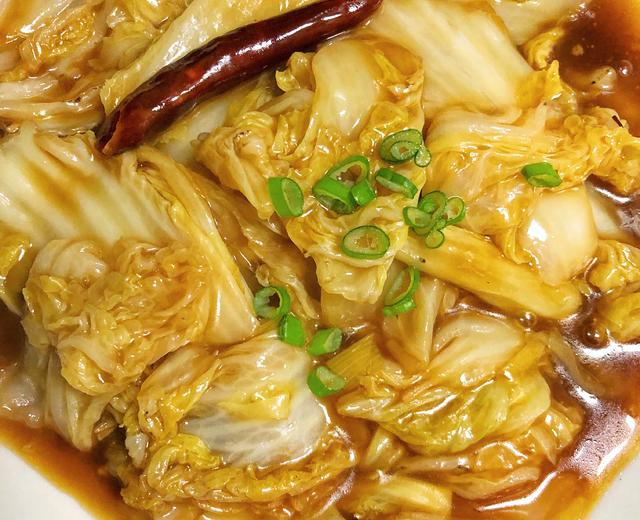

# 酸辣白菜

来源：[下厨房](https://www.xiachufang.com/recipe/105968639/)（原名：爆下饭的酸辣白菜（零难度））
标签：素菜、快手
用时：10分钟

作为肉食动物的我真的是对这种酸酸辣辣的素菜没有抵抗力呀……快手菜对新手小白很友好并且超级下饭！来试试吧

## 成品图

## 材料

- 娃娃菜 1-2颗
- 蒜末 少许
- 陈醋 2勺
- 生抽 1勺
- 蚝油 1勺
- 白糖 1勺
- 干辣椒 1-2个
- 淀粉 1勺

## 做法

1. 准备1-2颗娃娃菜清洗干净（小颗娃娃菜用2颗）用手撕成块状
2. 锅中放油爆炒娃娃菜2分钟左右
3. 准备蒜末、生抽1勺、陈醋2勺、蚝油一勺、白糖一勺、淀粉一勺 加入少许水调成料汁
4. 将料汁全部倒入锅中和娃娃菜翻炒均匀
5. 放入两个干辣椒翻炒
6. 出锅撒上点葱花点缀即可

## 小贴士

1、娃娃菜用手撕会比用刀切味道更好
2、如果喜欢口感甜一点的朋友可以增加糖量
3、辣椒可以换成小米辣等你喜欢的辣椒口味
