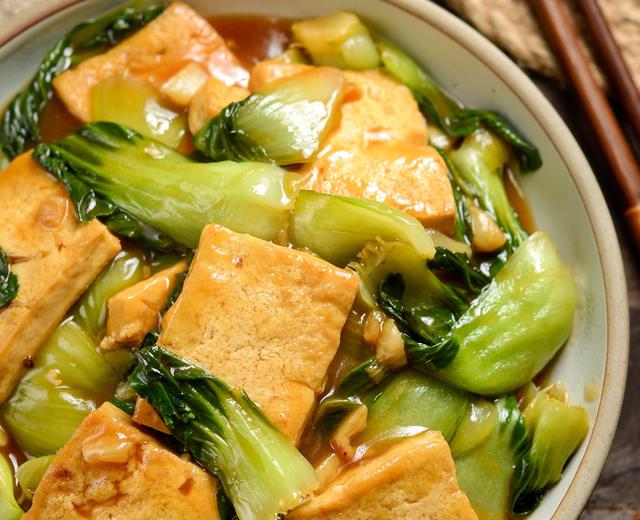

# 青菜炒豆腐

来源：[下厨房](https://www.xiachufang.com/recipe/106127128/)
标签：素菜、快手
用时：20分钟

这道菜已然成为逢年过节后的首选，逢年过节吃的太多，来一盘青菜豆腐健康又下饭

## 成品图

## 材料

- 老豆腐 1块
- 上海青苗 350g
- 大蒜 3-4瓣
- 盐 0.5g
- #调味汁
- 蚝油 1勺
- 生抽 2勺
- 白胡椒粉 1勺
- 白糖 3克
- 老抽 半勺
- 清水 半碗

## 做法

1. 上海青苗洗净（如果买不到小上海青可以买大的，对半切开）
2. 老豆腐切厚块
3. 小碗装上述材料调成汁
4. 锅里倒油，均匀撒入少许盐，烧热后把老豆腐铺在锅中煎
5. 将两面煎至金黄（如图
6. 捞出豆腐，锅内留底油
7. 爆香蒜末
8. 倒入上海青翻炒15秒
9. 将豆腐放入锅中，倒入料汁，大火烧开后盖盖子转中火烧1分钟
10. 打开盖子翻炒均匀
11. 最后淋入芡即可（一勺淀粉，小半碗水

## 小贴士

个人非常喜欢的一道素菜，又好做又下饭
