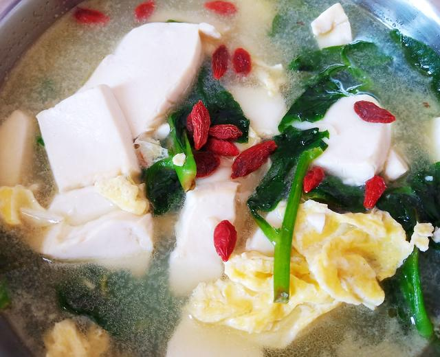

# 鸡蛋豆腐青菜汤

来源：[下厨房](https://www.xiachufang.com/recipe/106422610/)
标签：汤、快手
用时：15分钟

天热喜欢喝点清淡的蔬菜汤，既可以保持食物原本的味道，又可以滋润肠胃。今天就准备一道鸡蛋豆腐青菜汤尝尝鲜。

## 成品图

## 材料

- 鸡蛋 2个
- 青菜 3颗
- 豆腐 1块
- 枸杞 少许
- 食盐 适量
- 鸡汁 适量

## 做法

1. 两个鸡蛋打入碗中，加入少许食盐搅散。
2. 一块水豆腐切成博片备用
3. 一小把青菜清洗干净备用。
4. 两粒大蒜切碎备用。
5. 锅中烧油，打入鸡蛋液，炒成鸡蛋碎盛出。
6. 另起油锅 加入蒜末炒出香气。
7. 加入适量清水，豆腐和鸡蛋碎一起炖煮5分钟。
8. 最后加入青菜炖煮一分钟，加少许食盐和鸡汁调味，撒入少许枸杞即可。

## 小贴士

这道汤做法简单但营养丰盛，蛋白质含量高，清淡又美味，适合家庭和减脂者食用。
