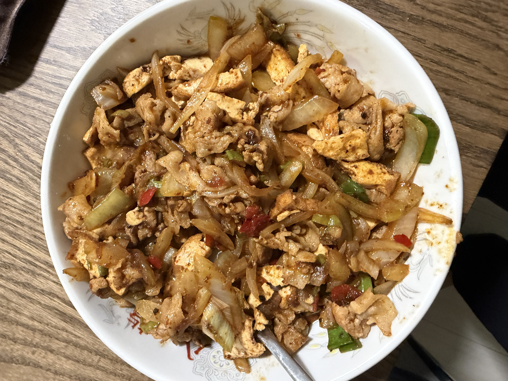
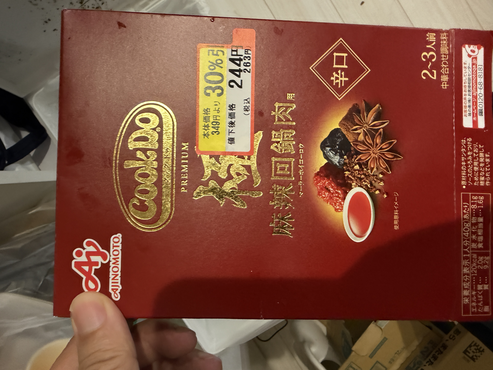

# 麻辣厚揚洋葱回锅肉

用味の素「Cook Do 極 麻辣回锅肉」酱料包做的家常炒菜，厚揚げ煎香、洋葱大葱提甜、猪肉吸饱麻辣酱汁。约 4 人份。

## 成品图

## 材料（4人份）

- 洋葱 1个
- 大葱 半条
- 猪肉（豚バラ） 250克
- 厚揚げ 300克
- 油 大さじ1（分两次用）
- 剁椒 大さじ1
- 味の素 Cook Do 極 麻辣回锅肉用 酱料包 1盒

## 做法

1. 厚揚げ切小条，洋葱、大葱、猪肉切小片/小块。
2. 锅中放油，先煎厚揚げ至表面略焦，盛出备用。
3. 锅中再放油和剁椒，放入洋葱、大葱炒1分钟。
4. 加入猪肉，继续翻炒1分钟。
5. 倒入 Cook Do 麻辣回锅肉酱料，放回厚揚げ，一起拌炒3分钟，装盘。

## 参考调料包

